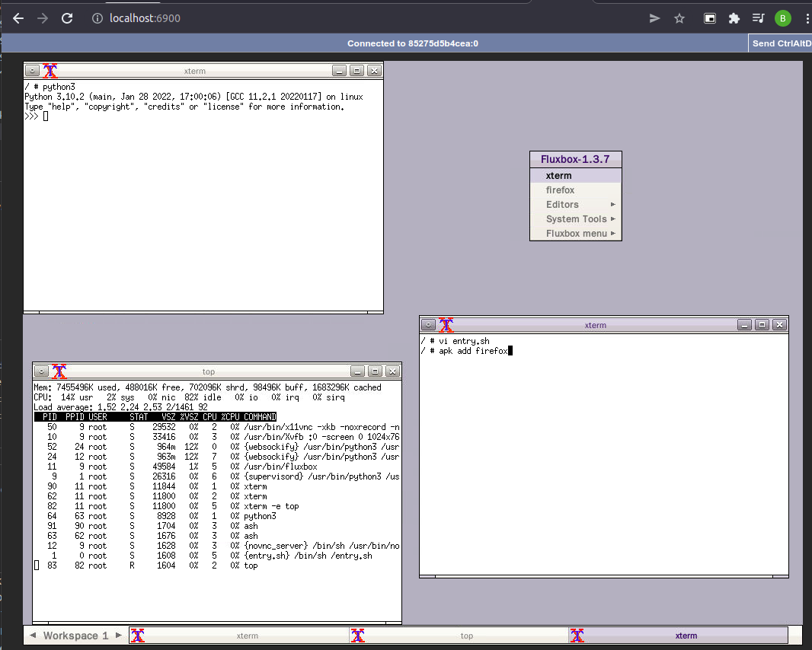

# AlpineVNCDocker
## tiny Alpine container with VNC and noVNC preinstalled

Comes with a VNC server on port 5900 and noVNC (HTML5 client) on port 6900.
Fluxbox desktop environment preinstalled.

Used for a quick linux sandbox environment. Base image is 182MB. 

---
## Instructions:
- Build the image using: ` docker build . -t alpinevncdocker:latest `

- Run container and map vnc port to `5900` and noVNC to `6900` using : ` docker run -d -p 5900:5900 -p 6900:6900 alpinevncdocker:latest `

- If you want to run container with password run: ` docker run -d -p 5901:5901 -p 6900:6900 -e VNC_PASSWORD="password" alpinevncdocker:latest `

